# Projet : Scraping et Analyse des Films de TMDB

## « User Guide »
Pour déployer et utiliser le dashboard sur une autre machine, suivez les étapes ci-dessous :

1. **Cloner le projet :**   
Dans le terminal, exécutez la commande suivante pour copier le projet sur votre machine :


    $ git clone https://github.com/Jackorea/DataEng_project.git

3. **Installer les dépendances :**  
Assurez-vous d'installer toutes les dépendances nécessaires listées dans le fichier requirements.txt. Exécutez :

   $ pip install -r requirements.txt

4. **Exécution et Déploiement :**
- Exécution locale :

```bash
python src/app.py
```

- Utilisation de Docker :

```bash
docker-compose up --build
```

## « Data » 
### Source des données

Les données utilisées dans ce projet sont extraites du site The Movie Database (TMDb) via le scraping web. TMDb est une plateforme en ligne qui fournit des informations détaillées sur les films, séries et personnalités du cinéma, incluant les titres, genres, durées, dates de sortie, mots-clés, langues, budgets, recettes, notes et distributions.

URL du site : https://www.themoviedb.org/movie?language=fr

### Format des données

Les informations extraites sont stockées dans un fichier JSON (output.json). Chaque entrée représente un film et contient les attributs suivants :

| **Attribut**       | **Description**                                | **Type**          |
|--------------------|--------------------------------------------|------------------|
| `title`           | Titre du film                               | `string`        |
| `genres`         | Liste des genres associés au film           | `list[string]`  |
| `runtime`        | Durée du film                               | `string`        |
| `release_date`   | Date de sortie en France                    | `string`        |
| `keywords`       | Liste de mots-clés décrivant le film        | `list[string]`  |
| `langue_origine` | Langue originale du film                    | `string`        |
| `budget_usd`     | Budget de production en dollars américains | `int`           |
| `recette_usd`    | Recette mondiale en dollars américains     | `int`           |
| `rating`         | Note moyenne du film sur TMDb (score sur 100) | `int`        |
| `actors`        | Liste des acteurs principaux                | `list[string]`  |
| `director`      | Nom du réalisateur                          | `string`        |


### Mode de collecte

Pour extraire les données du site The Movie Database (TMDb), j'ai utilisé une approche combinée de Scrapy et Selenium :

- #### Scrapy : 
Utilisé pour parcourir les pages et récupérer les données structurées telles que les titres, genres, durées, mots-clés, notes et distributions. Scrapy permet d'effectuer des requêtes HTTP rapides et d'extraire efficacement les informations via XPath ou CSS Selectors.

- #### Selenium : 
Utilisé pour interagir avec les pages dynamiques nécessitant l'exécution de JavaScript, comme le chargement différé des informations ou le clic sur des boutons pour afficher plus de contenu. Selenium permet de simuler un navigateur web et d'extraire les éléments visibles à l'écran.

L'exécution du script de scraping garantit une récupération automatique et structurée des données, qui sont ensuite enregistrées dans un fichier JSON (output.json) pour une exploitation ultérieure.


## « Developer Guide »
### Architecture du Projet

Le projet suit une architecture modulaire, où chaque composant est séparé par responsabilité. Voici une vue d'ensemble des principaux dossiers et fichiers :

```bash
DataEng_project
├── data/                           # Contient les données extraites (output.json)
├── src/                            # Code source principal
│   ├── app.py                      # Application principale (gestion de l'interface utilisateur)
│   ├── components/                 # Composants d'affichage (layout, pages, widgets)
│   │   └── layout.py               # Définition de la structure visuelle
│   ├── data_processing/            # Traitement des données extraites
│   │   ├── features.py             # Extraction de statistiques sur les films
│   │   ├── movie_data.py           # Prétraitement et analyse des films
│   ├── database/                   # Gestion des bases de données
│   │   └── mongodb_connector.py    # Connexion à la base de données MongoDB
│   ├── movieScraper/               # Scraping des données depuis TMDb
│   │   ├── movieScraper/           # Projet Scrapy
│   │   │   ├── spiders/            # Contient l'araignée Scrapy pour TMDb
│   │   │   │   └── tmdb_spider.py  # Scraper des films
│   │   └── scrapy.cfg              # Configuration Scrapy
│   ├── server.py                   # Lancement du serveur pour l'application
│   ├── utils/                      # Scripts utilitaires
│   │   └── script.py               # Scripts divers
├── requirements.txt                 # Dépendances Python
├── Dockerfile                       # Configuration Docker
├── docker-compose.yml               # Configuration Docker Compose
└── README.md                        # Documentation
```

### Workflow Général

#### 1. Scraping des films (**tmdb_spider.py**) :

Selenium charge dynamiquement les pages de TMDb.

Scrapy extrait les informations des films (titre, genres, budget, acteurs...).

Les données sont stockées sous forme de dictionnaire JSON.

#### 2. Stockage dans MongoDB (**mongodb_connector.py**) :

Connexion à MongoDB.

Sauvegarde des films dans la collection movies.

#### 3. Traitement des données (**movie_data.py et features.py**) :

Extraction de statistiques sur les genres, réalisateurs et acteurs.

Calcul des profits, RSI(Retour sur Investissement) et classifications des films.

#### 4. Affichage des résultats (**app.py**) :

Récupération des données depuis MongoDB et affichage sous forme de tableaux et graphiques.

## « Rapport d’analyse »

### 1. Nombre de films par genre:

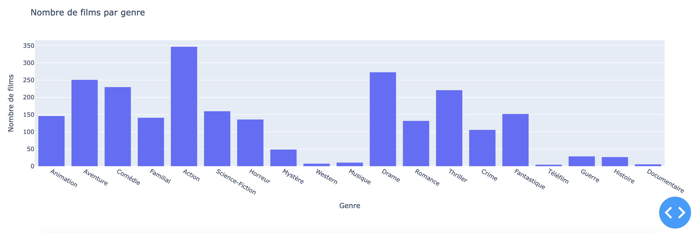

L'analyse des 880 films les plus populaires sur TMDB montre une prédominance des genres Action (347 films), Drame (273 films) et Aventure (251 films). Ces trois genres dominent probablement en raison de leur attrait universel et de leur capacité à générer de fortes recettes au box-office, notamment grâce à des franchises bien établies et des effets spéciaux spectaculaires.

À l'opposé, les genres les moins représentés sont le Western (8 films), le Téléfilm (5 films) et le Documentaire (6 films). Cela peut s'expliquer par un public cible plus restreint et une demande plus faible sur les plateformes de diffusion de films populaires.

- **Prédiction :** Étant donné la tendance actuelle, on peut supposer que les films d'Action et d'Aventure continueront à dominer le marché du cinéma grand public, tandis que les genres moins populaires resteront limités à des productions de niche.

### 2. Rentabilité des films:

#### 2.1 Répartition de la rentabilité des films:

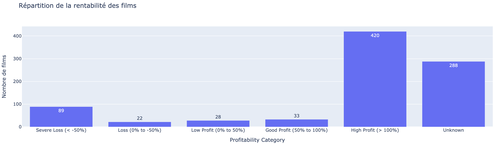

Inférieur à -50% : 90 films

De 0 à -50% : 22 films

De 0 à 50% : 28 films

De 50 à 100% : 33 films

Supérieur à 100% : 420 films

La majorité des films les plus populaires sont rentables, avec 420 films dépassant un retour sur investissement (RSI) de 100%. En revanche, 112 films affichent une rentabilité négative, ce qui suggère que même parmi les films populaires, certains ne parviennent pas à couvrir leurs coûts de production.

#### 2.2 Proportion de films rentables vs non rentables:

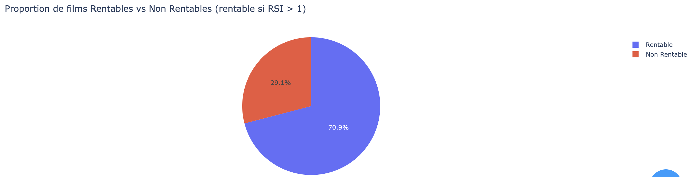

Rentables : 420 films (70.8%)

Non rentables : 173 films (29.2%)

Le taux élevé de rentabilité montre que la sélection des films populaires favorise les productions à succès. Toutefois, près de 30% des films restent non rentables, ce qui souligne les risques financiers associés à l'industrie cinématographique.

- **Prédiction :** Avec la montée en puissance des plateformes de streaming et des stratégies de diffusion hybride, on pourrait s'attendre à une augmentation des films à rentabilité plus faible, compensée par des abonnements plutôt que par des entrées en salles.

### 3. Score d'évaluation par genre:

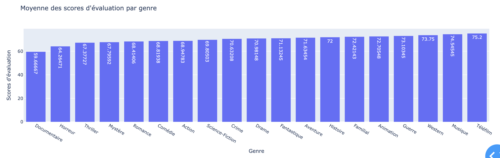

**Top 3 des genres par score moyen:**

Téléfilm (75.2)

Musique (74.5)

Western (73.7)

Ces scores élevés sont probablement biaisés par le faible nombre de films dans ces catégories, où seuls les meilleurs titres sont retenus. Pour une analyse plus représentative, les genres avec plus de 100 films réalisés montrent des scores élevés pour :

Animation (72.7)

Familial (72.4)

Aventure (71.6)

- **Prédiction :** Les genres Animation et Familial pourraient continuer à bénéficier d’une forte appréciation du public, en raison de leur large accessibilité à toutes les tranches d’âge.

### 4. Analyse dynamique:

#### 4.1 Distribution du RSI (Retour sur Investissement):

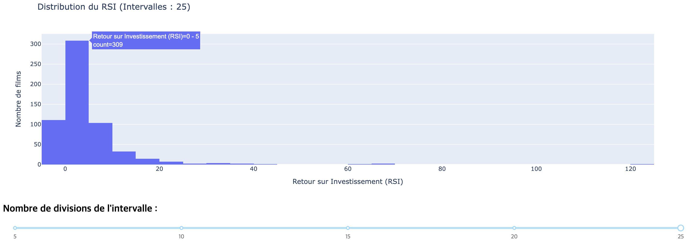

RSI entre 0 et 5 : 309 films

RSI entre -5 et 0 : 112 films

RSI entre 5 et 10 : 104 films

La majorité des films ont un RSI modéré, tandis que peu atteignent des valeurs extrêmes.

#### 4.2 Corrélation entre Budget et Recette:

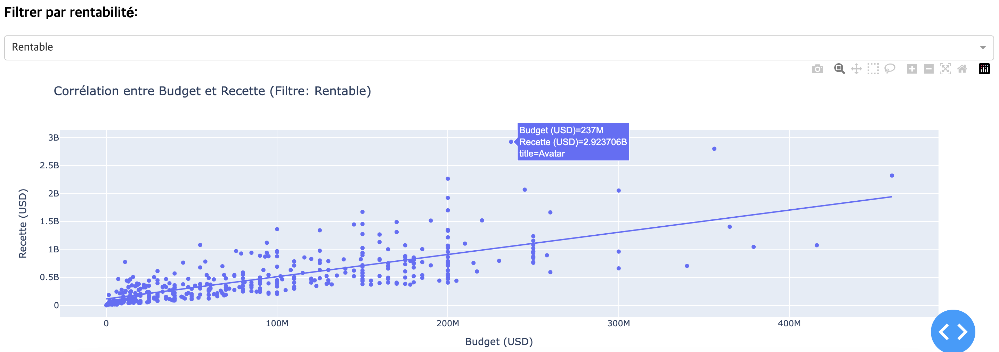

Film avec la plus haute recette : "Avatar" (2.9B USD)

Film avec le plus gros budget : "Avatar : La voie de l'eau" (460M USD)

Film non rentable avec la plus haute recette : "La Petite Sirène" (570M USD)

Film non rentable avec le plus gros budget : "Gladiator 2" (310M USD)

Cela illustre que même des films ayant de grosses recettes peuvent être non rentables en raison de budgets colossaux.

### 5. Rentabilité et score d'évaluation:

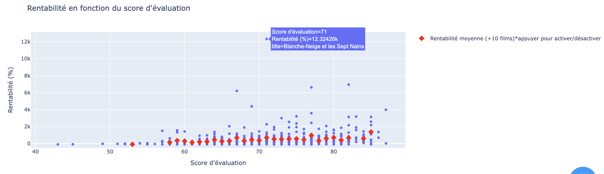

On observe une corrélation positive entre la rentabilité et le score d'évaluation : en moyenne, les films mieux notés sont plus rentables. Cela suggère que la satisfaction du public joue un rôle clé dans le succès financier d'un film.

- **Prédiction :** Les productions avec des critiques positives et un bon bouche-à-oreille continueront à être privilégiées par les studios.

### 6. Acteurs et Réalisateurs:

#### 6.1 Acteurs

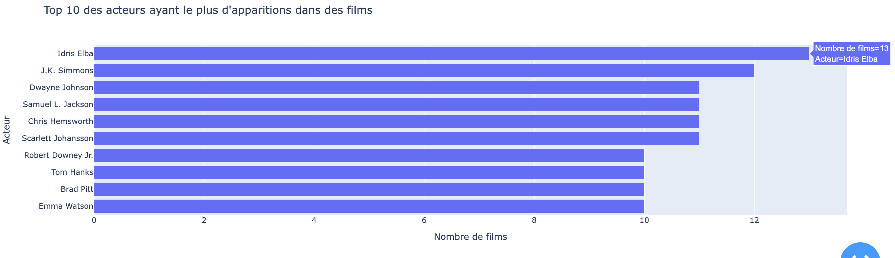
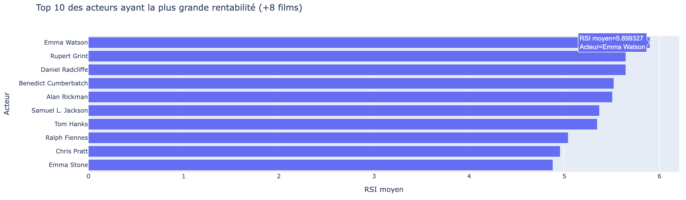

- Acteur le plus présent : Idris Elba (13 films)

- Actrice la plus rentable (RSI moyen supérieur à 8 films) : Emma Watson (RSI moyen : 5.9)

- Acteurs apparaissant dans les deux classements (présence et rentabilité) :

Samuel L. Jackson

Tom Hanks

Emma Watson

#### 6.2 Réalisateurs

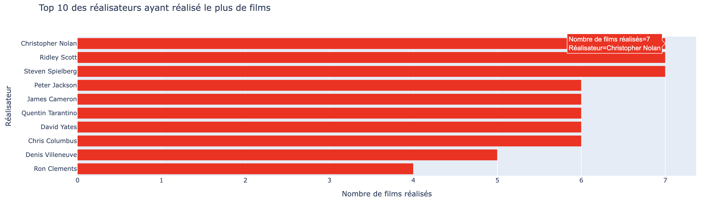
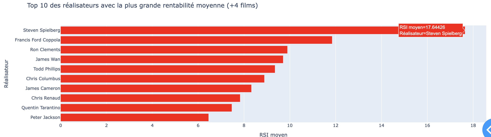

- Réalisateur ayant réalisé le plus de films : Steven Spielberg (7 films)

- Réalisateur le plus rentable : Steven Spielberg (RSI moyen : 17.6)

- Autres réalisateurs présents dans les deux classements :

Curtis Colombus

James Cameron

Quentin Tarantino

Peter Jackson

- **Prédiction :** Les réalisateurs ayant un historique de films rentables continueront à attirer des budgets élevés pour de nouveaux projets.

### 7. Distribution des durées de films:

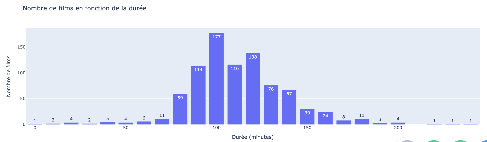

La plupart des films ont une durée d’environ 100 minutes (177 films), suivis de 120 minutes (138 films), puis 110 minutes (116 films) et 90 minutes (114 films).

Cela montre une préférence pour des films d’une durée moyenne comprise entre 90 et 120 minutes, optimisant l’expérience cinématographique tout en maximisant les séances en salle.

### 8. Rentabilité et durée de films:

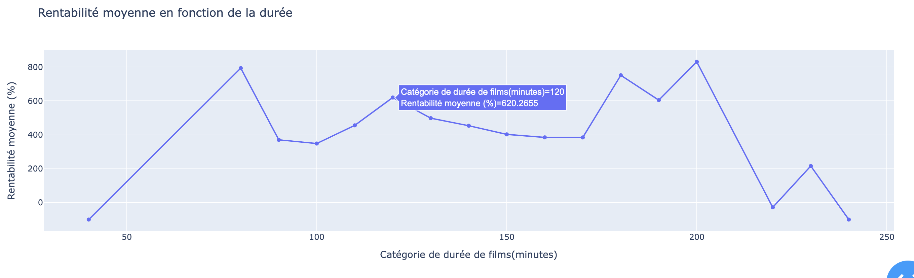

Les films de 80 minutes et 200 minutes affichent la rentabilité la plus élevée, mais leur faible échantillon rend ces résultats peu fiables.

Parmi les groupes de durées avec plus de 50 films, les durées les plus rentables sont :

120 minutes (RSI moyen : 6.2)

130 minutes (RSI moyen : 4.98)

110 minutes (RSI moyen : 4.55)

Cela suggère que les films plus longs (autour de 2 heures) tendent à être plus rentables, peut-être en raison d’un meilleur développement narratif et d’une plus grande satisfaction du public.

- **Prédiction :** Les films de 2 heures continueront à dominer le marché, bien que les formats plus courts soient favorisés sur les plateformes de streaming.

## « Copyright » 
### Attestation sur l'honneur 
Nous  déclarons sur l’honneur que le code fourni a été produit par moi/nous même. 